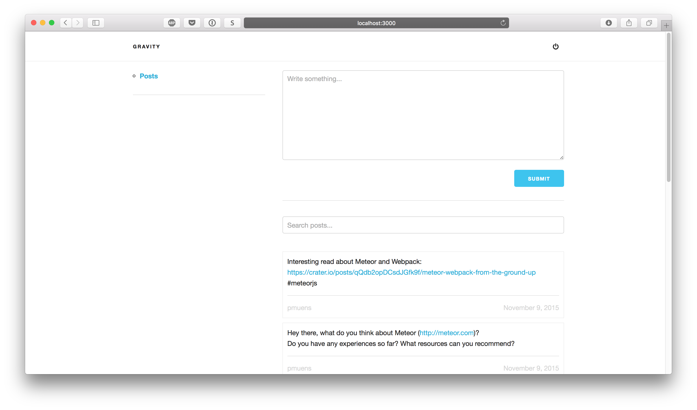

# Gravity
[Gravity](http://joingravity.herokuapp.com/) is an open source social network built with Meteor.

The most recent version is deployed at [http://joingravity.herokuapp.com/](http://joingravity.herokuapp.com/). Meet us there!

## Setup
1. Clone / fork the repository
2. `cd` into the downloaded folder
3. run `meteor`
4. head over to `http://localhost:3000`

## How can I help?
Any kind of contribution is welcomed!
Take a look at our [issues](https://github.com/GravityProject/gravity/issues) to get an overview where you can help.

## Contributors
[Here](https://github.com/GravityProject/gravity/graphs/contributors) is the list of all the contributors so far. Thank you!
